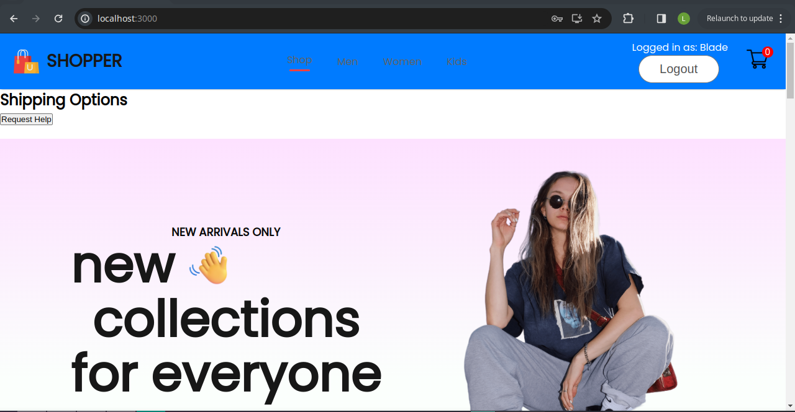

# **Online Store**
This project is a web application built with React and react-redux, featuring a fictional online store. It includes pages for browsing products, viewing product details, managing the shopping cart, and user authentication.



## **Installation**
1. Clone the repository:

```bash
git clone https://github.com/Lusanda11/ecommerce_shop
```

2. Install dependencies:

```bash
npm install
```

3. Configure redux:

- Create a redux directory and set up reducers and actions to be dispatched.

- This project uses Redux for state management. Redux helps manage the state of the application in a predictable way, making it easier to debug and test.


4. Start the development server:

```bash
npm start
```

## **Dependencies**

- **React**: JavaScript library for building user interfaces.
- **React Router**: Declarative routing for React applications.
- **Redux**: State management library for JavaScript applications.
- **React Redux**: Official React bindings for Redux.
- **Redux Toolkit**: Official Redux package for efficient Redux development.
- **Tailwind CSS**: Utility-first CSS framework for rapidly building custom designs.
- **Firebase**: Platform for building web and mobile applications by Google.

## **Setting Up Redux**
```bash
npm install @reduxjs/toolkit react-redux
```
